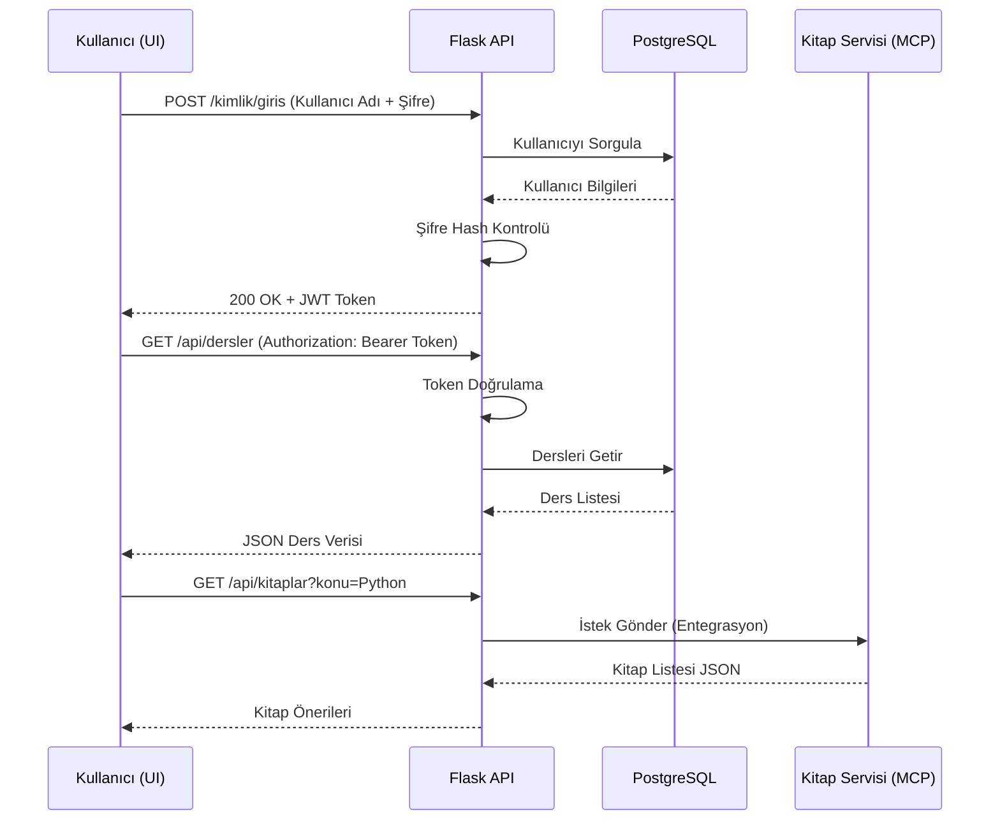
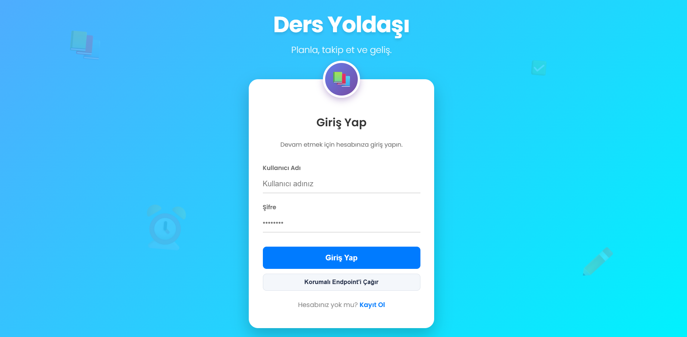
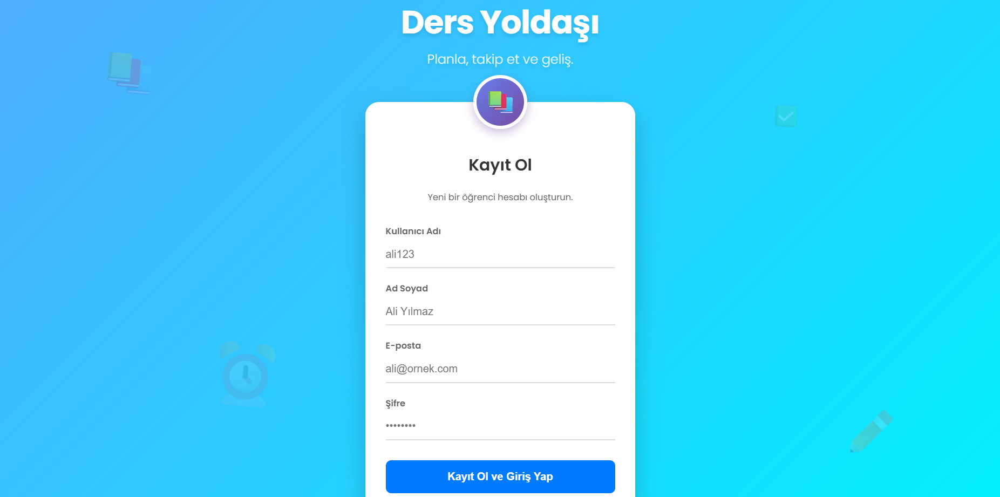
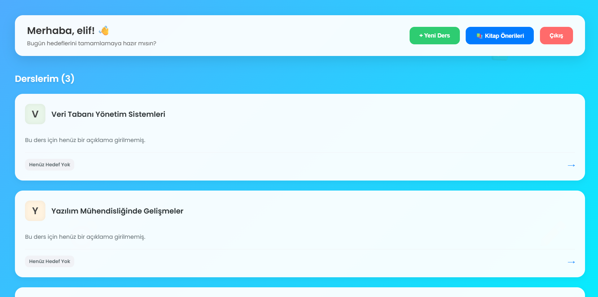
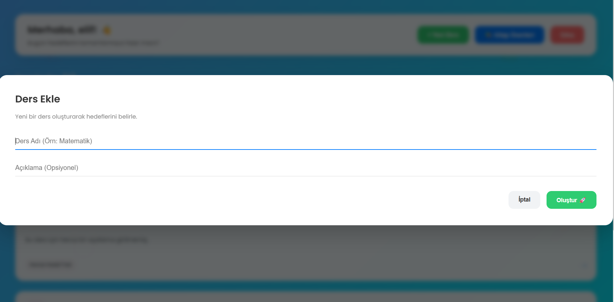
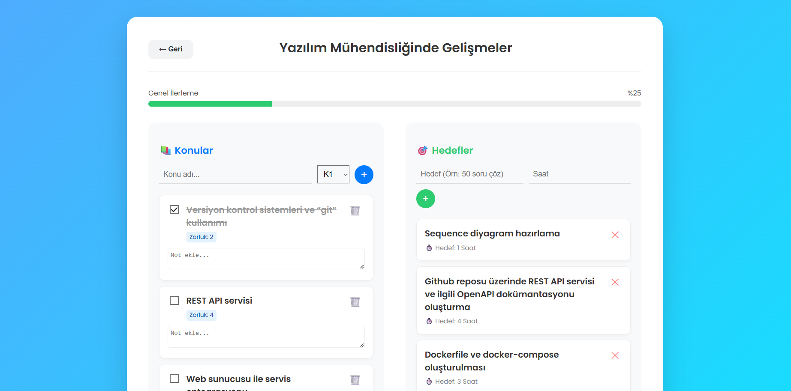
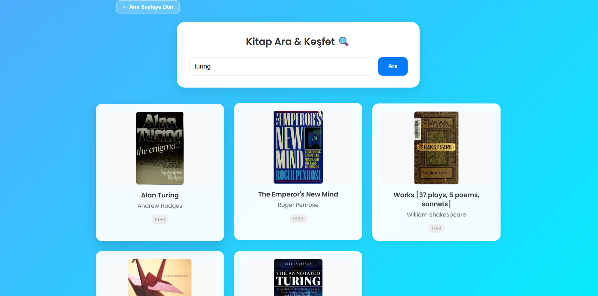

# Ders Yoldaşı - Öğrenci Asistanı & Kitap Öneri Sistemi

Bu proje, öğrencilerin derslerini ve hedeflerini takip edebileceği full-stack bir web uygulamasıdır. Ayrıca yapay zeka destekli (MCP tabanlı) bir mikroservis ile kullanıcının çalışma konularına göre kitap önerileri sunar.

Proje; **Yazılım Mühendisliğinde Gelişmeler I** dersi final ödevi kapsamında, modern yazılım mimarisi prensiplerine (Microservices, Containerization, RESTful API) uygun olarak geliştirilmiştir.

---

## 🚀 Özellikler ve Ödev Gereksinimleri

Bu proje, final ödevinde belirtilen aşağıdaki kriterleri **tam puan** alacak şekilde karşılamaktadır:

* **Docker & Docker Compose:** Tüm proje (API, UI, Veritabanı, Mikroservis) tek bir komut ile ayağa kalkar.
* **RESTful API & Swagger:** Python Flask ile yazılan API, `/apidocs` adresinde Swagger arayüzü ile tam dokümante edilmiştir.
* **Full-Stack Mimari:** Frontend (React/Vite) ve Backend (Flask) ayrı servisler olarak haberleşir.
* **Veritabanı (PostgreSQL):** Veriler kalıcı olarak PostgreSQL veritabanında saklanır.
* **JWT Kimlik Doğrulama:**
    * `/kimlik/giris` ve `/kimlik/kayit` (Public Endpoint - Token gerektirmez).
    * `/kimlik/korumali` ve `/api/dersler` (Protected Endpoint - Bearer Token gerektirir).
* **Mikroservis Entegrasyonu:** "Kitap Öneri Servisi" harici bir servis olarak çalışır ve ana API ile haberleşir.
* **Görselleştirme:** Proje akışını anlatan MermaidJS diyagramı (aşağıda mevcuttur).
* **Yapay Zeka Analizi:** Proje güvenliği için yapay zekadan 5 maddelik iyileştirme raporu alınmıştır.

---

## 🛠️ Teknolojiler

* **Backend:** Python 3.11, Flask, SQLAlchemy, Flask-JWT-Extended
* **Frontend:** React 18, Vite, Bootstrap/CSS
* **Veritabanı:** PostgreSQL 15
* **Mikroservis:** FastMCP (Kitap Servisi)
* **Container:** Docker, Docker Compose
* **Dokümantasyon:** Flasgger (OpenAPI/Swagger)

---

## ⚙️ Kurulum ve Çalıştırma

Bilgisayarınızda **Docker** ve **Docker Compose** yüklü olması yeterlidir.

1.  **Terminali Açın:**
    Proje dosyalarının bulunduğu klasörde (`docker-compose.yml` dosyasının olduğu dizin) bir terminal veya komut satırı penceresi açın.

2.  **Servisleri Başlatın:**
    Aşağıdaki komutu yazarak tüm uygulamayı ayağa kaldırın:
    ```bash
    docker compose up --build
    ```
    *(İlk kurulumda imajların indirilmesi ve derlenmesi internet hızınıza bağlı olarak birkaç dakika sürebilir.)*

3.  **Uygulamaya Erişim:**
    Terminalde loglar akmaya başladıktan sonra tarayıcınızdan aşağıdaki adreslere gidebilirsiniz:
    * **Ana Uygulama (UI):** [http://localhost:5173](http://localhost:5173)
    * **Swagger API Dokümanı:** [http://localhost:5000/apidocs](http://localhost:5000/apidocs)
    * **Veritabanı:** Port 5432 (Kullanıcı: `ders_user`, Şifre: `ders_pass`)

---

## 👤 Örnek Test Kullanıcısı

Sistemi hızlıca test etmek için veritabanına kayıt olmanıza gerek kalmadan aşağıdaki bilgileri kullanabilirsiniz (veya "Kayıt Ol" ekranından yeni kullanıcı oluşturabilirsiniz):

| Alan | Değer |
| :--- | :--- |
| **Kullanıcı Adı** | `elif` |
| **Şifre** | `1234` |

---

## 📊 Proje Akış Şeması (MermaidJS)

Aşağıdaki diyagram, kullanıcının giriş yapıp dersleri listeleme sürecindeki veri akışını ve servisler arası haberleşmeyi göstermektedir:


   

## 🛡️ Yapay Zeka Güvenlik ve İyileştirme Önerileri

- `.env` kullanarak şifrelerin gizlenmesi  
- CORS sadece frontend adresine açılmalı  
- Docker için healthcheck mekanizması eklenmeli  
- Container’lar root user ile çalıştırılmamalı  
- Giriş endpointlerine rate limiting eklenmeli  

---

## 📸 Ekran Görüntüleri

### 🔐 Giriş Ekranı
  

### 🔐 Kayıt Ekranı


### 📚 Ana Ekran
  

### 📚 Ders Ekleme
  

### 📚 Ders Detay


### 📖 Kitap Önerileri
